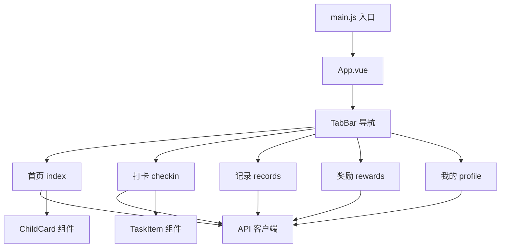
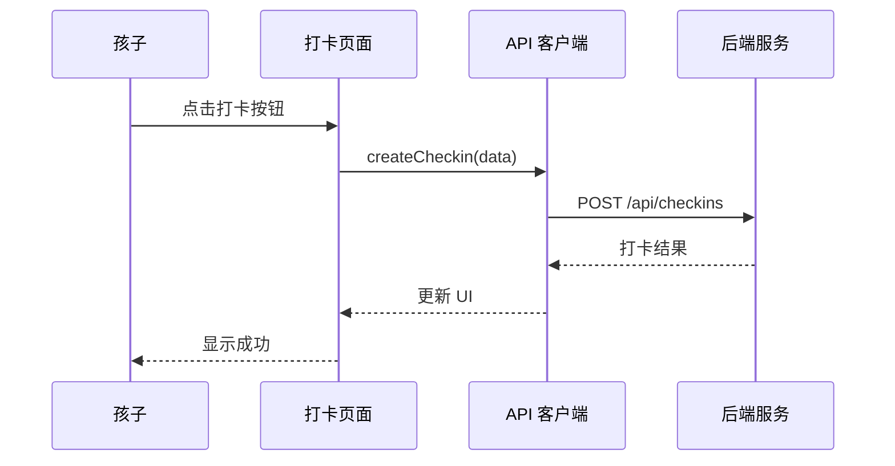

# 小程序端

> 上次更新：2026-05-25
> 主要来源：`star-park/miniprogram/src/`

## 1 概览

基于 Vue 3 + uni-app 的移动端应用，供孩子和家长使用。支持 H5 预览和微信小程序发布。核心功能为孩子每日打卡。

## 2 架构

### 2.1 组件图

> 来源：`star-park/miniprogram/src/pages.json`, `star-park/miniprogram/src/main.js`

### 2.2 关键接口

| 组件 | 文件 | 用途 |
|------|------|------|
| ChildCard | `components/ChildCard.vue` | 孩子信息卡片 |
| TaskItem | `components/TaskItem.vue` | 任务项组件 |
| api | `api/index.js` | uni.request 封装 |
| rewards | `pages/rewards/index.vue` | 奖励查看页面 |

> 来源：`star-park/miniprogram/src/components/`, `star-park/miniprogram/src/api/index.js`

## 3 执行流程

### 3.1 打卡流程

## 4 配置

| 选项 | 类型 | 默认值 | 说明 |
|------|------|--------|------|
| BASE_URL | string | `http://localhost:3001/api` | 后端 API 地址 |

> 来源：`star-park/miniprogram/src/api/index.js:1`

## 5 错误处理

- 请求失败时显示 uni.showToast 提示
- 网络错误直接 reject，由调用方处理

## 参见

- [架构概览](../ARCHITECTURE.md)
- [API 接口文档](../api.md)
