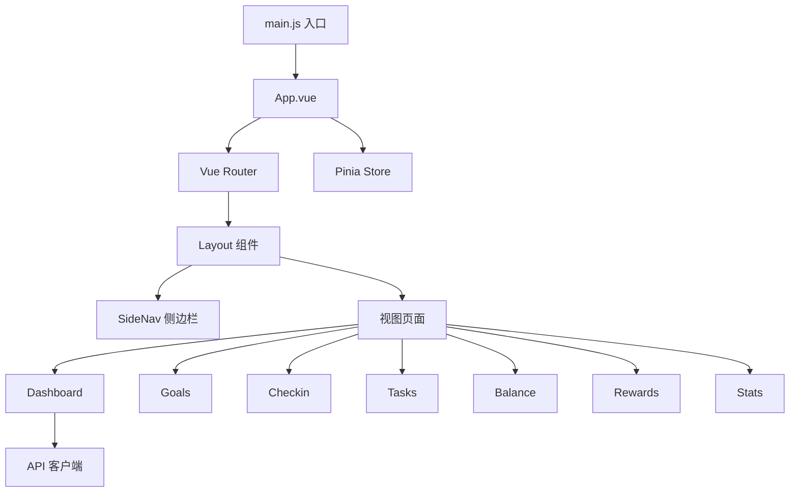
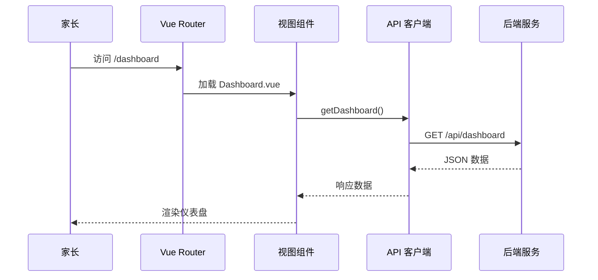

# 管理后台前端

> 上次更新：2026-05-25
> 主要来源：`star-park/pc-admin/src/`

## 1 概览

基于 Vue 3 + Element Plus 的管理后台，供家长使用。包含仪表盘、目标管理、打卡、任务管理、积分记录、奖励管理和数据统计等功能。

## 2 架构

### 2.1 组件图

> 来源：`star-park/pc-admin/src/router/index.js`, `star-park/pc-admin/src/main.js`

### 2.2 关键接口

| 组件 | 文件 | 用途 |
|------|------|------|
| Layout | `components/Layout.vue` | 主布局（侧边栏 + 内容区） |
| SideNav | `components/SideNav.vue` | 侧边导航菜单 |
| ChildCard | `components/ChildCard.vue` | 孩子信息卡片 |
| api | `api/index.js` | axios HTTP 客户端封装 |

> 来源：`star-park/pc-admin/src/components/`, `star-park/pc-admin/src/api/index.js`

## 3 执行流程

### 3.1 页面加载流程

## 4 配置

| 选项 | 类型 | 默认值 | 说明 |
|------|------|--------|------|
| baseURL | string | `/api` | API 基础路径 |
| timeout | number | 10000 | 请求超时（ms） |

> 来源：`star-park/pc-admin/src/api/index.js:4-6`

## 5 错误处理

- axios 响应拦截器统一处理错误
- 错误信息通过 `console.error` 输出
- 未实现全局错误提示（Element Plus Message）

## 参见

- [架构概览](../ARCHITECTURE.md)
- [API 接口文档](../api.md)
