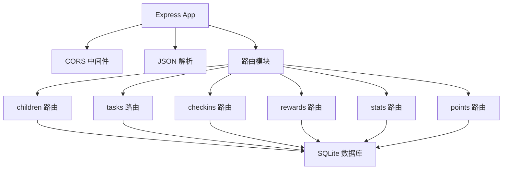
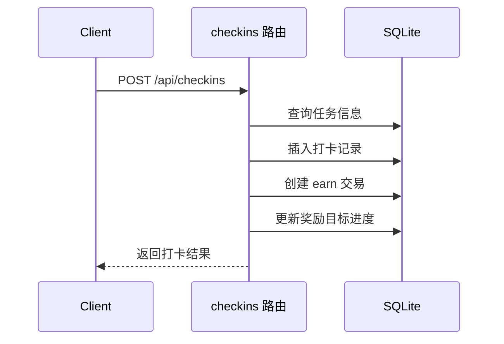
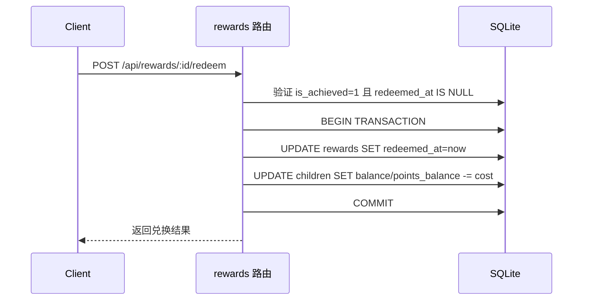

# 后端 API 服务

> 上次更新：2026-05-25
> 主要来源：`star-park/server/src/`

## 1 概览

Express.js 后端服务，提供 RESTful API 处理孩子管理、任务打卡、奖励目标和积分系统。使用 better-sqlite3 嵌入式数据库，无需外部数据库服务。

## 2 架构

### 2.1 组件图

> 来源：`star-park/server/src/index.js:1-27`

### 2.2 关键接口

| 路由 | 端点 | 方法 | 用途 |
|------|------|------|------|
| children | `/api/children` | GET | 获取所有孩子及任务 |
| children | `/api/children` | POST | 添加孩子 |
| children | `/api/children/:id/balance` | GET | 获取积分余额 |
| children | `/api/children/:id/transactions` | GET | 获取交易记录 |
| tasks | `/api/tasks` | GET | 获取任务列表 |
| tasks | `/api/tasks` | POST | 创建任务 |
| tasks | `/api/tasks/:id` | PUT | 更新任务 |
| tasks | `/api/tasks/:id` | DELETE | 删除任务 |
| checkins | `/api/checkins` | GET | 获取打卡记录 |
| checkins | `/api/checkins` | POST | 创建打卡 |
| rewards | `/api/rewards` | GET | 获取奖励目标 |
| rewards | `/api/rewards` | POST | 创建奖励目标 |
| rewards | `/api/rewards/:id` | PUT | 更新奖励目标 |
| rewards | `/api/rewards/:id` | DELETE | 删除奖励目标 |
| rewards | `/api/rewards/:id/redeem` | POST | 兑换奖励（事务保护） |
| stats | `/api/stats/:childId` | GET | 获取统计数据 |
| stats | `/api/dashboard` | GET | 获取仪表盘数据 |
| points | `/api/points` | GET | 获取积分记录 |
| points | `/api/points` | POST | 添加积分 |
| health | `/api/health` | GET | 健康检查 |

> 来源：`star-park/server/src/index.js:21-27`

### 2.3 关键类型

| 类型 | 文件 | 行 | 用途 |
|------|------|------|------|
| children 表 | `database.js` | 19-26 | 孩子基本信息 |
| tasks 表 | `database.js` | 28-37 | 任务定义 |
| checkins 表 | `database.js` | 39-49 | 打卡记录 |
| rewards 表 | `database.js` | 51-60 | 奖励目标（含description/reward_unit/redeemed_at） |
| transactions 表 | `database.js` | 62-70 | 金钱交易记录 |
| points 表 | `database.js` | 72-79 | 积分记录 |

> 来源：`star-park/server/src/database.js:18-80`

## 3 执行流程

### 3.1 打卡奖励流程

> 来源：`star-park/server/src/routes/checkins.js:31-87`

### 3.2 奖励兑换流程

> 来源：`star-park/server/src/routes/rewards.js`

## 4 配置

| 选项 | 类型 | 默认值 | 说明 |
|------|------|--------|------|
| PORT | number | 3001 | 服务监听端口 |
| DB_PATH | string | `data/star-park.db` | SQLite 数据库文件路径 |

> 来源：`star-park/server/src/index.js:14`, `star-park/server/src/database.js:10`

## 5 错误处理

| 错误 | 状态码 | 何时 | 恢复 |
|------|--------|------|------|
| 400 Bad Request | 400 | 缺少必填字段 | 补充字段重试 |
| 404 Not Found | 404 | 资源不存在 | 检查 ID |
| 500 Internal Error | 500 | 数据库异常 | 检查数据库状态 |

## 参见

- [架构概览](../ARCHITECTURE.md)
- [API 接口文档](../api.md)
